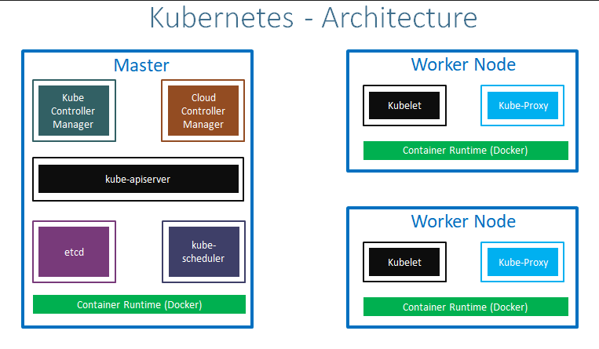
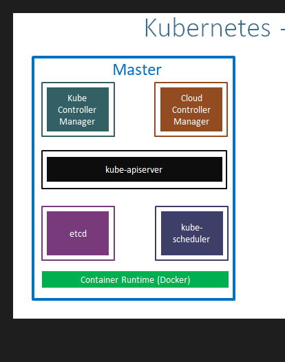

    

## Doug

- Why services creating acrose the nodes
- what is managed and unmanaged worker nodes
- What is helper Containers or (side- car) 

### My Update 
- **on 07 July 2023**
  - Installed AWS CLI in Windows
  - Installed Kubectl in Windows
  - Installed Eksctl in Windows

### image testing 

